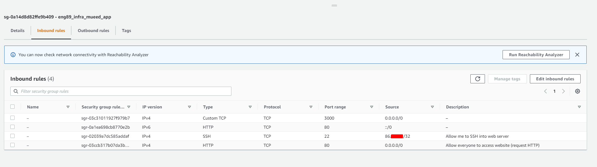
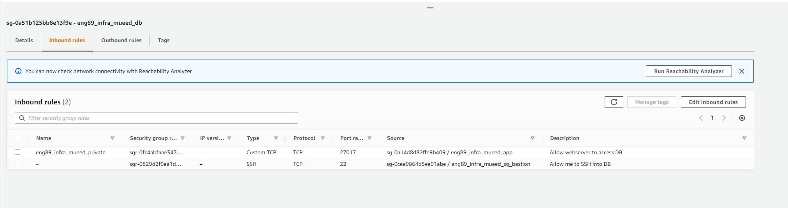
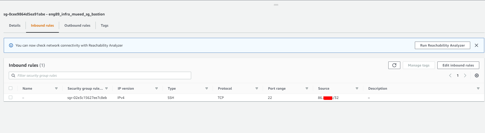
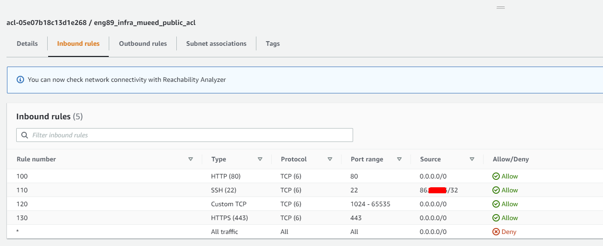
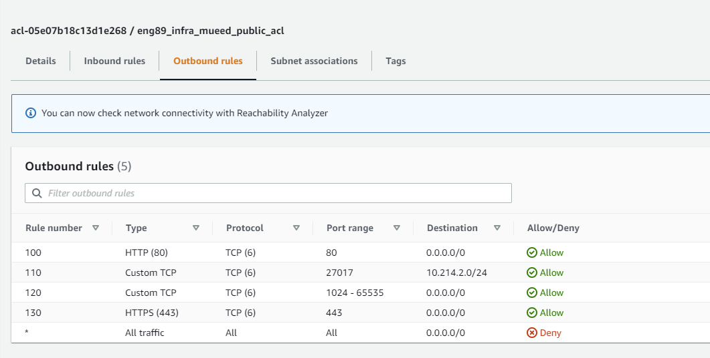
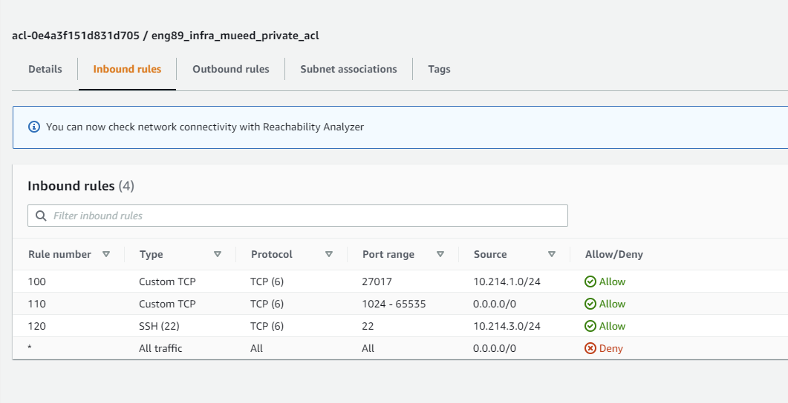
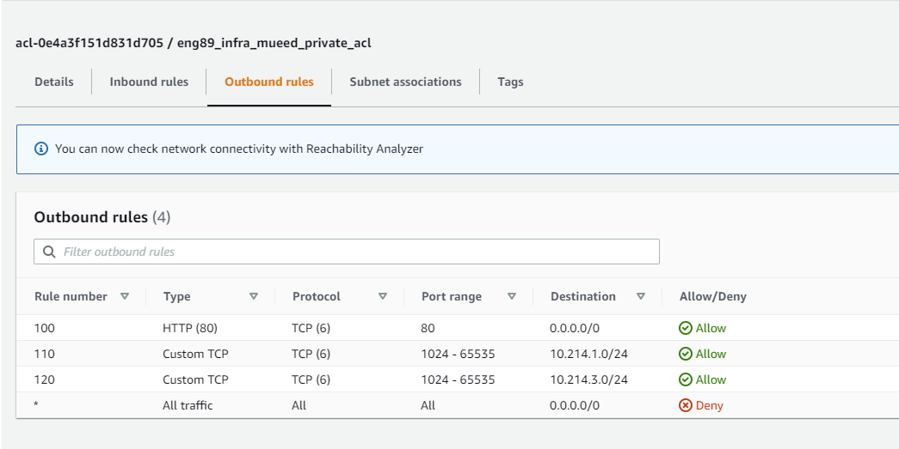
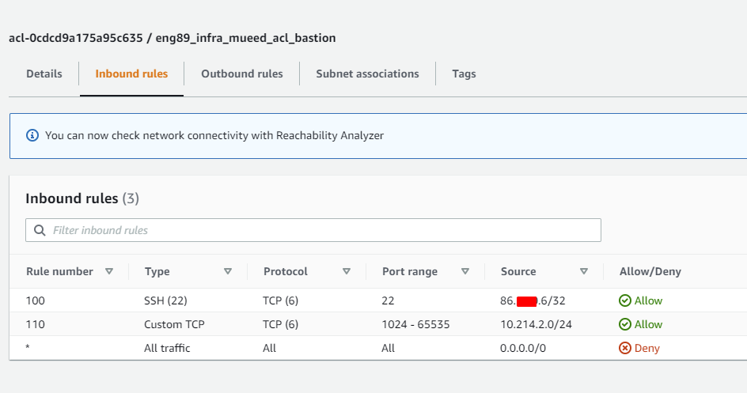
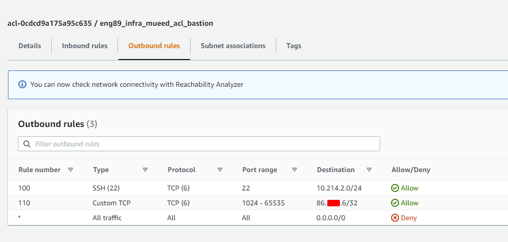
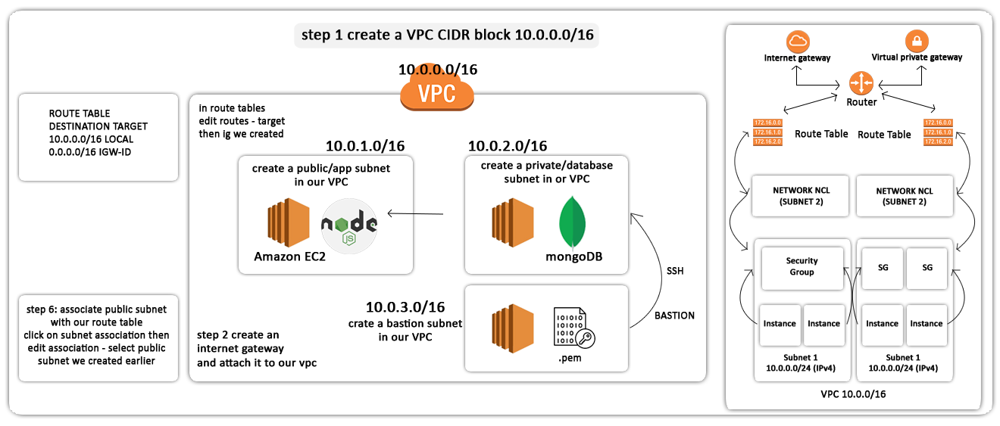

- create a VPC we will use `10.214.x.x/16` for the CIDR
- create a public and private and bastion subnet these must have the same first 2 ocets as the VPC IP so public IP is `10.214.1.0/24` and private is `10.214.2.0./24` and bastion is `10.214.3.0/24`
- create an internet gateway and then go to actions and attach to VPC then select the VPC 
- create a new route table in here go to routes, edit routes then add the internet gateway
- in route tables go to subnet associations and edit subnet asso then put in the public and bastion subnet
- for each subnet we need to create a `Security Group (SG)` and a `Network access list (NACL)`
- for security group we can leave outbound as all traffic and all ips but we need to specify in NACL

- once all security groups and NACL are created we need to associate them with the appropriate subnet
- once everything in VPC is ready we need to head to `EC2` and create `3 instances` this includes `app` `db` `bastion`
- app and bastion will have an auto assigned IP but db will not
- each security group needs to be assigned in the security tab when creating instances
- once done everything is completed we just need to transfer our `SSH` .pem key to our bastion server then we can use that key to SSH from bastion to DB

